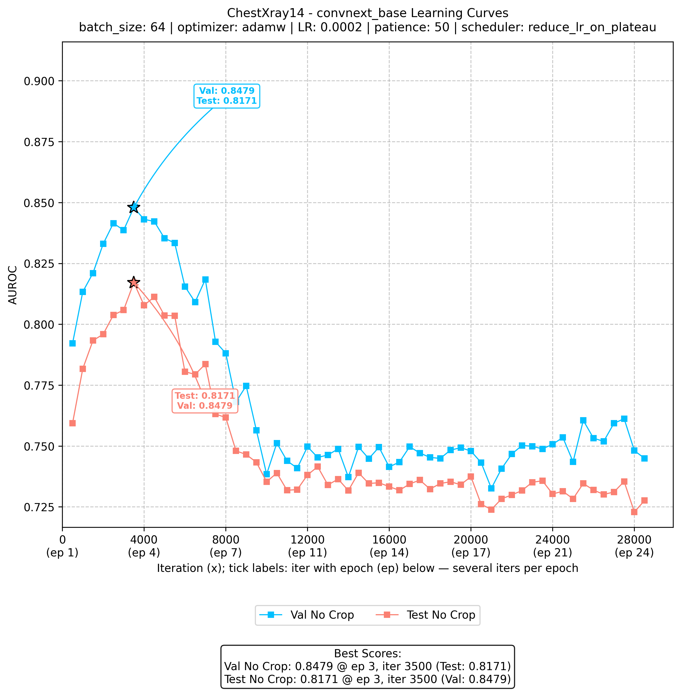
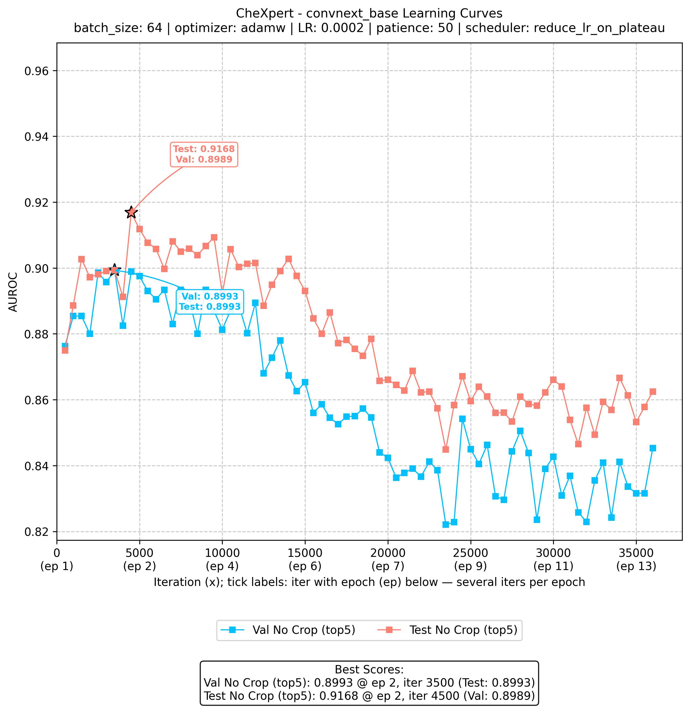
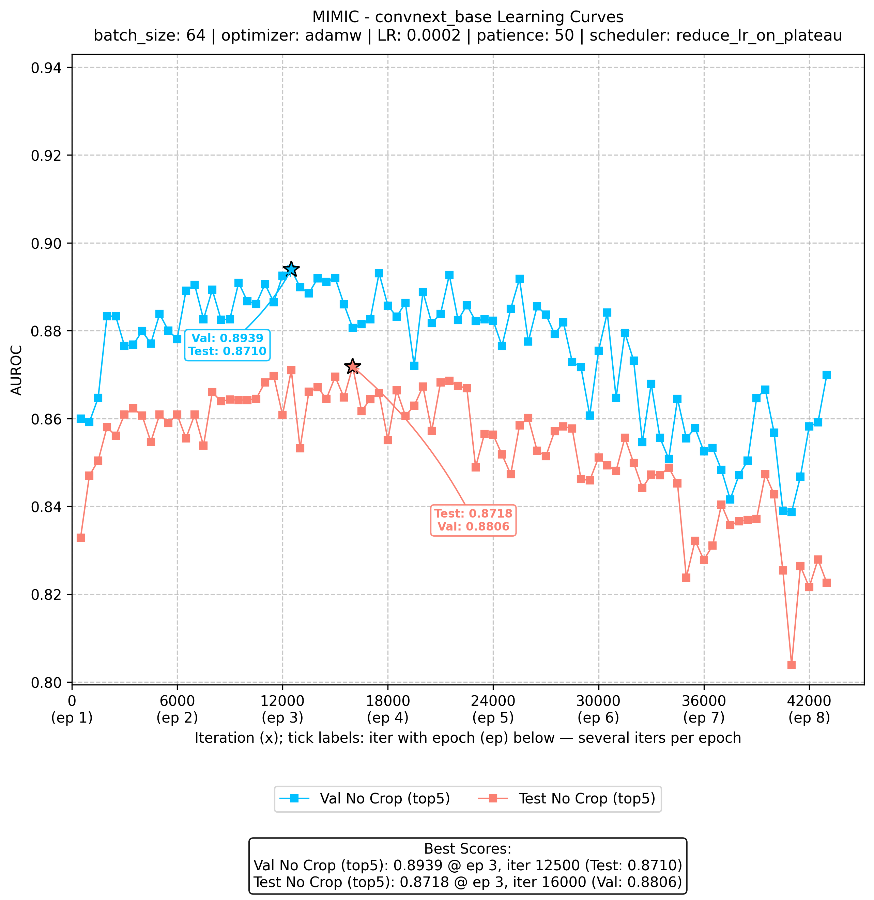
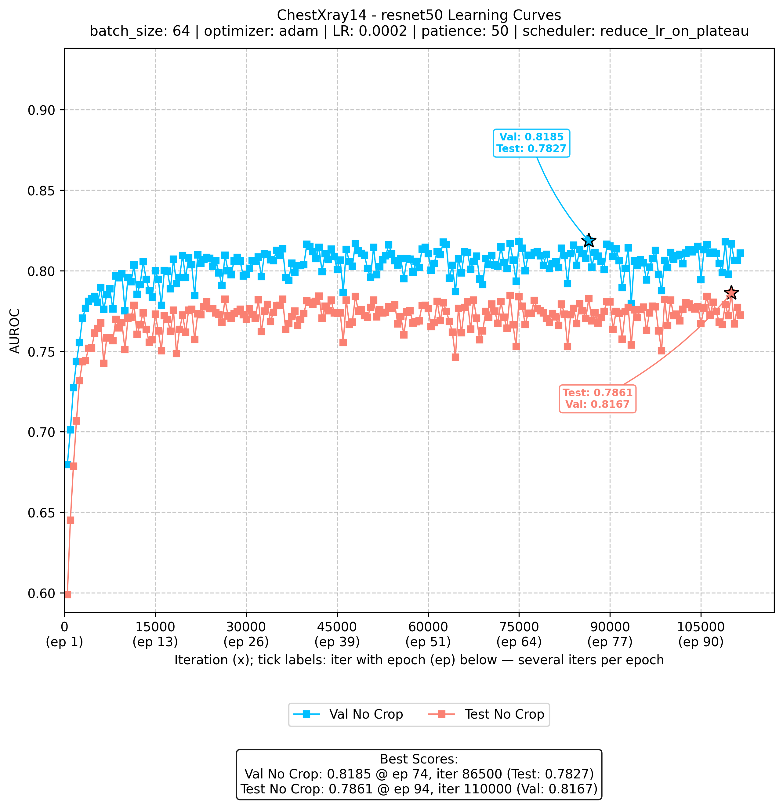
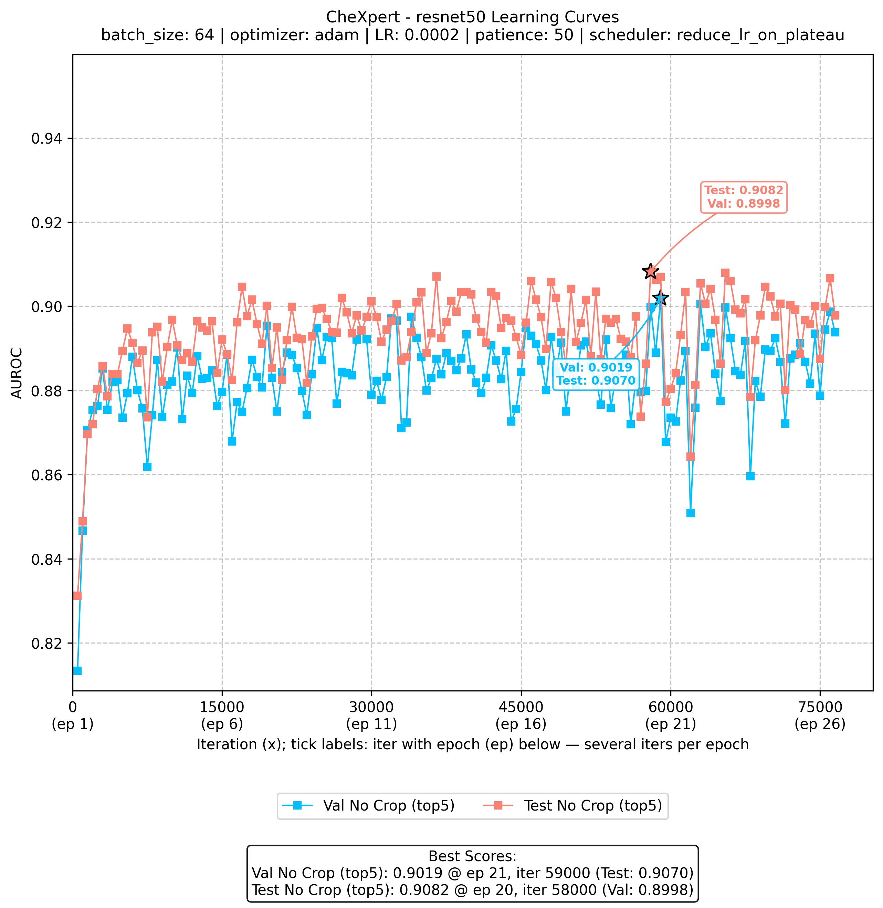
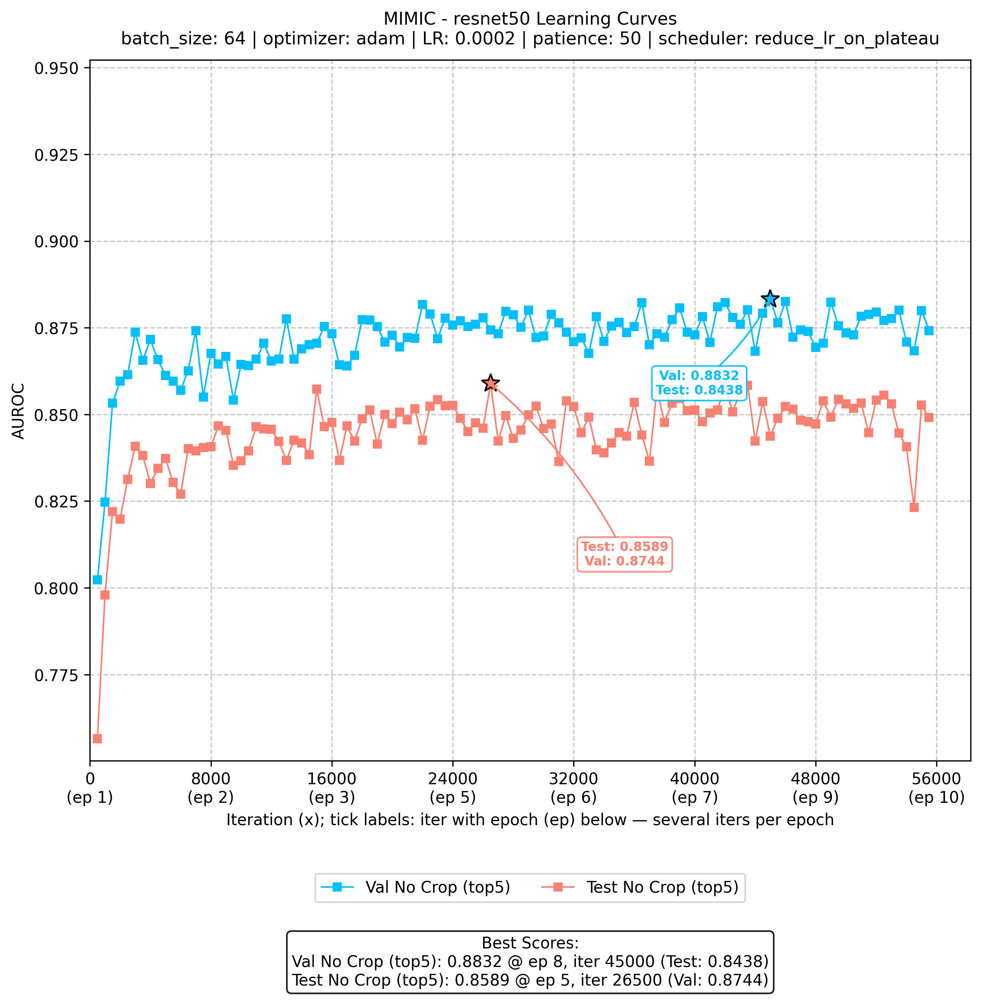
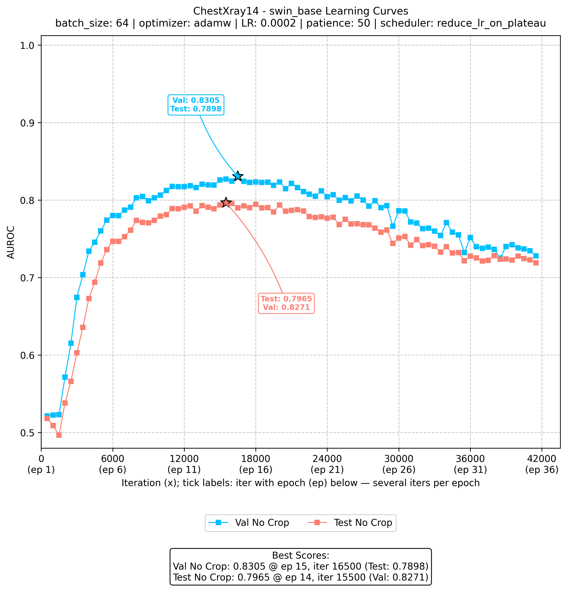
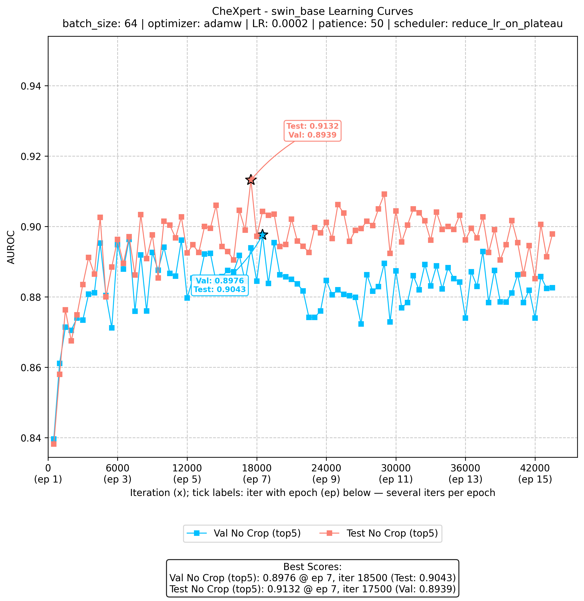
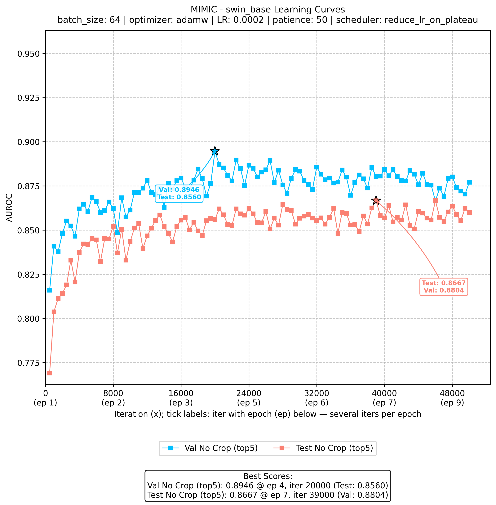
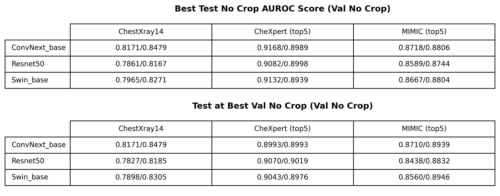

# plots-example

Example plots (PNG files) rendered inline.

## Learning curves

| Backbone | ChestXray14 | CheXpert | MIMIC |
|---|---|---|---|
| convnext_base |  |  |  |
| resnet50 |  |  |  |
| swin_base |  |  |  |

## Summary tables

